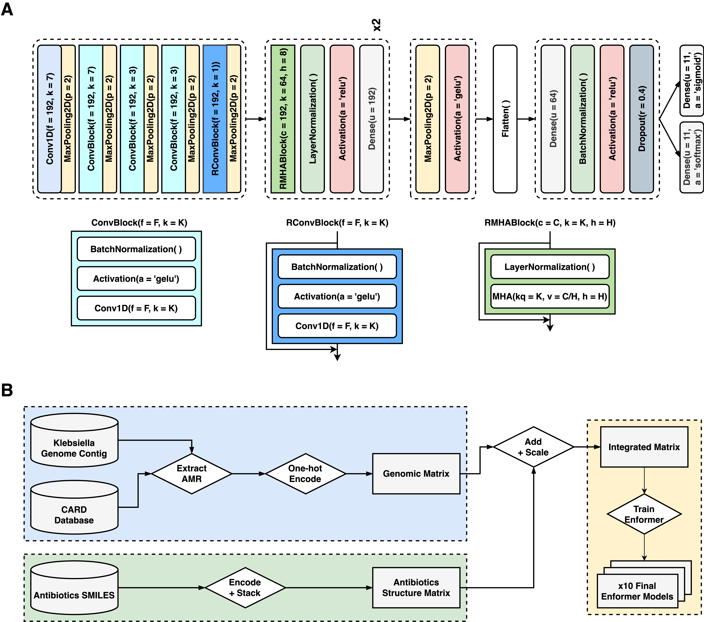

# Enformer_MIC_Prediction
Welcome to the _Enformer_MIC_Prediction_ repository. This computational framework has been tailored to predict antibiotics MIC values of Klebsiella pneumoniae using genomic data and antibiotic molecular structures. This model adapts the Enformer architecture, initially conceptualized by [Avsec et al.](https://www.nature.com/articles/s41592-021-01252-x), to address the challenge of AMR prediction.
## Background
### Feature Engineering & Data Processing
**Extracting AMR Genes:** Focusing on the practical application, the Enformer_MIC_Model optimizes computational efficiency by targeting AMR genes. By utilizing the Resistance Gene Identifier (RGI) tool associated with CARD database, we extracted the AMR genes from each Kpn strains.

**Padding:** Sequences of 'N' character paddings representing unknown nucleotides are applied at both terminus and in between the AMR genes to standardized the length of input sequence as 98,304 bp.

### Encoding & Data Transformation
**Genomic Data Transformation:** Nucleotide bases 'A', 'C', 'G', 'T', and 'N' were respectively encoded as '[1, 0, 0, 0]', '[0, 1, 0, 0]', '[0, 0, 1, 0]', '[0, 0, 0, 1]', and '[0, 0, 0, 0]', resulting in the Genomic matrix of dimensions (98304, 4).

**Antibiotics Data Encoding:** We procured the isomeric SMILES data for antibiotics from the PubChem21 database. This data was transformed into a (130, 20) matrix using one-hot character encoding. The (130, 2) matrix was reshaped into (650, 4) and then vertically stacked to synchronize with the dimensions of the Genomic matrix.

### Final Data Preparation
**Combining & Labeling:** The encoding for each genome-antibiotic pair from our 32,309 samples was achieved by summing the Genomic and SMILES matrices and then undergoing a linear scaling operation (division by 2). Each pair was then labeled using the integer value equivalent to the Log2 of the laboratory-derived MIC value. This transformed our challenge into a multi-class classification task. We explored two labeling techniques: a conventional one-hot encoding of the exact label and a soft labeling strategy that highlighted 1-tier accurate labels close to the precise label to differentiate them from inaccurate labels.

<br />
<p align="center">
  
</p>
<br />

## Local Usage
Below are the steps to get your environment set up and the model training initiated.
### 1. Clone current repository 
To clone the repository and navigate into it, execute the following commands in your terminal:

```
git clone https://github.com/ByeonggyuRyu/Enformer_MIC_Prediction.git
cd Enformer_MIC_Prediction
```
### 2. Install requirements
Before running the model, you need to install the required libraries.
Create an environment with python version 3.7.15 and install the requirements by running:

```
conda create --name enformer_mic python=3.7.15
conda activate enformer_mic
pip install -r requirements.txt
```
This command will install all the necessary packages as listed in the _requirements.txt_ file.

### 3. Format the data into tfrecords
Run the following command to create a tfrecord of the train, validation, test dataset under the folder _./data/tfrecord_data_

```
python save_as_tfrecord.py
```
To track the progress of data transformation, type in the following command in a seperate terminal:
```
watch -d -n 5 ls -sh ./data/tfrecord_data
```
The final size of test and validation set is 4.4GB, training data 39GB.

### 4. Initiate Training
With the environment set up, you can now begin the training process. Run the following command:

```
python enformer_train.py ./results/train_log.txt ./results/test_result.txt ./results/model ./data/tfrecord_data/train_data.tfrecord ./data/tfrecord_data/val_data.tfrecord ./data/tfrecord_data/test_data.tfrecord
```
The command line arguments should be in the order of:
<br />
&nbsp;&nbsp; **1.**  file to write the training log (*"./results/train_log.txt"*)
<br />
&nbsp;&nbsp; **2.**  file to write the test result (*"./results/test_result.txt"*)
<br />
&nbsp;&nbsp; **3.**  folder to save the trained model (*"./results/model"*)
<br />
&nbsp;&nbsp; **4.**  tfrecord of train data (*"./data/tfrecord_data/train_data.tfrecord"*)
<br />
&nbsp;&nbsp; **5.**  tfrecord of validation data (*"./data/tfrecord_data/val_data.tfrecord"*)
<br />
&nbsp;&nbsp; **6.**  tfrecord of test data (*"./data/tfrecord_data/test_data.tfrecord"*)
